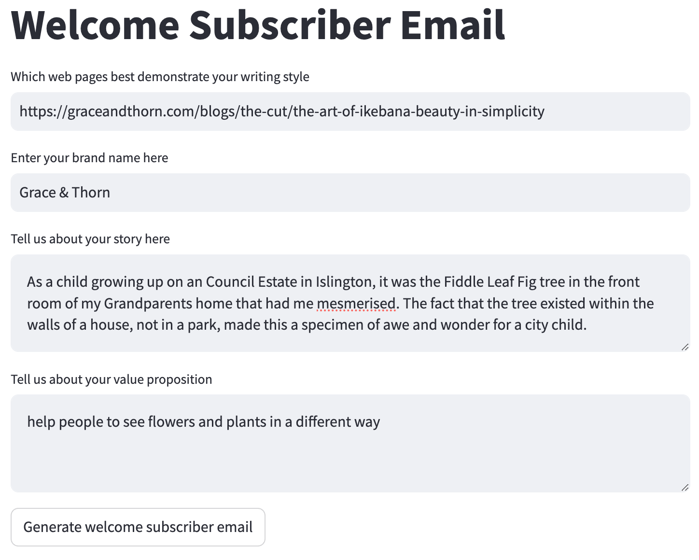
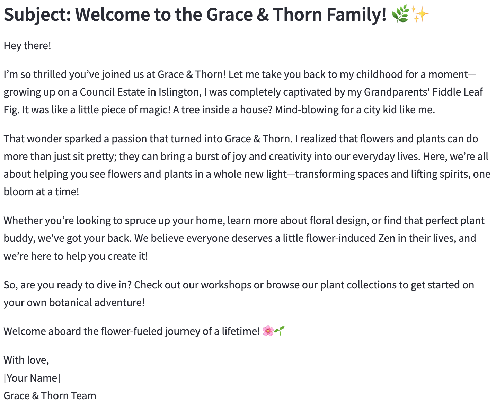

# AI-Assisted Onboarding

This repository is used to implement the PoC of generating email based on the email template.
The email generator will mimicking the writing style of the user, accompanied with user's provide context
to generate the email in a specific purpose.

## Install

### Prepare the .env file

Set "PROJECT_NAME" and "OPENAI_API_KEY" in the `.env` file

### Build the docker images

```bash
docker-compose build
```

### Run the docker

```bash
docker-compose up -d
```

## How to use

1. Access the UI url at: http://localhost:7010
2. Enter the username / password (see `client/config.yaml`)
3. Enter the information to generate the email
   
4. Click to `Generate welcome subscriber email` button
5. Wait for 5-10s, the email will be displayed
   

## Maintainer

- Tri Ngo (nhutringo@gmail.com)
